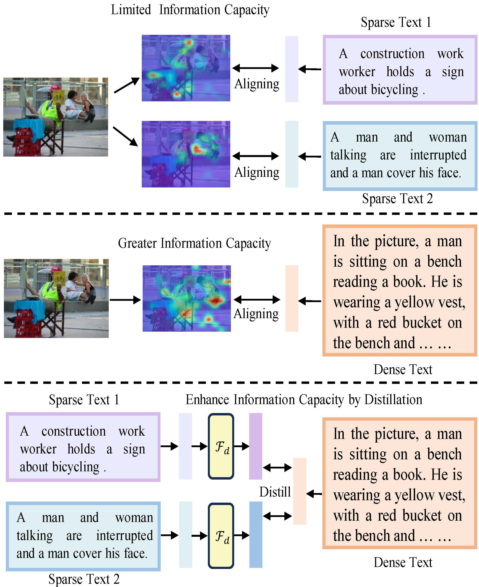

# Aligning Information Capacity Between Vision and Language via Dense-to-Sparse Feature Distillation for Image-Text Matching

The official codes for our paper "Aligning Information Capacity Between Vision and Language via Dense-to-Sparse Feature Distillation for Image-Text Matching" [[arxiv](https://arxiv.org/pdf/2503.14953?)], which is accepted by the International Conference on Computer Vision, ICCV 2025.
We referred to the implementations of [VSE++](https://github.com/fartashf/vsepp), [GPO](https://github.com/woodfrog/vse_infty), and [LAPS](https://github.com/CrossmodalGroup/LAPS) to build up the repository. 


## Introduction
Enabling Visual Semantic Models to effectively handle multi-view description matching has been a longstanding challenge. 
Existing methods typically learn a set of embeddings to find the optimal match for each view's text and compute similarity. However, the visual and text embeddings learned through these approaches have limited information capacity and are prone to interference from locally similar negative samples.
To address this issue, we argue that the information capacity of embeddings is crucial and propose Dense-to-Sparse Feature Distilled Visual Semantic Embedding (D2S-VSE), which enhances the information capacity of sparse text by leveraging dense text distillation.
Specifically, D2S-VSE is a two-stage framework. In the pre-training stage, we align images with dense text to enhance the information capacity of visual semantic embeddings.
In the fine-tuning stage, we optimize two tasks simultaneously, distilling dense text embeddings to sparse text embeddings while aligning images and sparse texts, enhancing the information capacity of sparse text embeddings.
Our proposed D2S-VSE model is extensively evaluated on the large-scale MS-COCO and Flickr30K
datasets, demonstrating its superiority over recent state-of-the-art methods.

<div align=center>

</div>
(Top) In previous methods, when addressing problems with varying information density, a set of visual embeddings is learned to match the most similar text embeddings. However, this approach results in learned embeddings with limited information capacity.
(Mid) Since dense text has a higher information density than sparse text, training with aligned dense text results in image embeddings with greater information capacity.
(Bottom) Sparse text embedding can be distilled through dense text embedding to enhance its information capacity, enabling the matching of text descriptions from different perspectives with a single visual embedding. (Best viewed in color)


## Preparation

### Environments
We recommended the following dependencies:
- python >= 3.8
- torch >= 1.12.0
- torchvision >= 0.13.0
- transformers >=4.32.0
- opencv-python
- tensorboard


### Datasets

We have prepared the caption files for two datasets in  `data/` folder, hence you just need to download the images of the datasets. 
The Flickr30K (f30k) images can be downloaded in [flickr30k-images](https://www.kaggle.com/datasets/hsankesara/flickr-image-dataset). The MSCOCO (coco) images can be downloaded in [train2014](http://images.cocodataset.org/zips/train2014.zip), and [val2014](http://images.cocodataset.org/zips/val2014.zip).


We hope that the final data are organized as follows:

```
data
├── coco  # coco captions
│   ├── train_ids.txt
│   ├── train_caps.txt
│   ├── testall_ids.txt
│   ├── testall_caps.txt
│   ├── coco_train.jsonl  # dense caption extracted by LlaVa 
│   └── id_mapping.json
│
├── f30k  # f30k captions
│   ├── train_ids.txt
│   ├── train_caps.txt
│   ├── test_ids.txt
│   ├── test_caps.txt
│   ├── f30k_train.jsonl  # dense caption extracted by LlaVa 
│   └── id_mapping.json
│
├── flickr30k-images # f30k images
│
├── coco-images # coco images
│   ├── train2014
│   └── val2014
```

## Training
First, we set up the **arguments**, detailed information about the arguments is shown in ```arguments.py```.

- `--dataset`: the chosen datasets, e.g., `f30k` and `coco`.
- `--data_path`: the root path of datasets, e.g., `data/`.
- `--multi_gpu`: whether to use the multiple GPUs (DDP) to train the models.
- `--gpu-id`, the chosen GPU number, e.g., 0-7.
- `--logger_name`, the path of logger files, e.g., `runs/f30k_test` or `runs/coco_test`
- `--pretrain`, specifies the pretraining stage to use.
- `--distill`, specifies the dense-to-sparse finetuning stage.

### Pretrain Stage 
Taking `f30k + vit_224` as an example, we first perform **pre-training**, and the resulting weights are saved in the `runs/f30k/vit_224/pretrain` directory.

```
CUDA_VISIBLE_DEVICES=0,1 python -m torch.distributed.run --nproc_per_node=2 --master_port=25901  train.py --dataset f30k --multi_gpu 1 --logger_name runs/f30k/vit_224/pretrain --img_res 384 --batch_size 64 --vit_type google/vit-base-patch16-224-in21k --embed_size 512 --pretrain 
```

### Finetune stage
In the **finetuning** stage, we set the `weight_path` parameter to `runs/f30k/vit_224/pretrain` to load the pre-trained weights.
```
CUDA_VISIBLE_DEVICES=0,1 python -m torch.distributed.run --nproc_per_node=2 --master_port=25901  train.py --dataset f30k --multi_gpu 1 --logger_name runs/f30k/vit_224/distill --img_res 384 --batch_size 64 --vit_type vit --embed_size 512 --distill --weight_path runs/f30k/vit_224/pretrain/model_best.pth --use_decoder --num_tokens 100 
```   
We have compiled all the training scripts, such as `train_vit_224_f30k.sh`, `train_swin_224_f30k.sh`, and others. You can simply run `train_MODELNAME_DATASET.sh` to train both stages together.


## Evaluation
Run ```eval.py``` to evaluate the trained models on f30k or coco datasets, and you need to specify the model paths.

```
python eval.py --dataset f30k --data_path data/ --gpu-id 0
python eval.py --dataset coco --data_path data/ --gpu-id 1
```


## Performances
The following tables show the reproducing results of cross-modal retrieval on **MSCOCO** and **Flickr30K** datasets. 
We provide the training logs, checkpoints, performances, and hyper-parameters.

|Datasets| Visual encoders |I2T R@1|I2T R@5|I2T R@10|T2I R@1|T2I R@5|T2I R@10|rSum|Model checkpoint|
|:---:|:---:|:---:|:---:|:---:|:---:|:---:|:---:|:---:|:---:|
|Flickr30K |ViT_224 | 82.8 | 96.1 | 98.3 | 68.5  | 91.3 | 94.9 | 531.9 |[Pretrain](https://drive.google.com/drive/folders/1Gmwo1l2KmvW1P-gm24RwfV-HCJ2m8kSw?usp=sharing) [Distill](https://drive.google.com/drive/folders/19kNpUjcdx6zAUHoNZ7sBmTYwbGZARpJr?usp=sharing)|
|Flickr30K |ViT_384 | 84.0 | 97.5 | 99.1 | 70.3  | 91.6 | 95.3 | 537.9 |[Pretrain](https://drive.google.com/drive/folders/1esvd1sOvSQIKl8pW9p-qpA7JOszTixdC?usp=sharing) [Distill](https://drive.google.com/drive/folders/11tuPZmSI-Qa0SuJ42GQ_FZjUrUn6ibpV?usp=sharing)|
|Flickr30K |Swin_224 | 87.2 | 98.4 | 99.9 | 73.0 | 93.5 | 96.7 | 548.7 |[Pretrain](https://drive.google.com/drive/folders/1lMqWxux0rV6PV8bBYPi1O16saE222w3t?usp=sharing) [Distill](https://drive.google.com/drive/folders/1YfhzBYz7LK7Ljy7X5rYUlD8JCN3EsCSt?usp=sharing)|
|Flickr30K |Swin_384 | 87.8 | 99.0 | 99.7 | 75.7 | 94.1 | 96.9 | 553.2 |[Pretrain](https://drive.google.com/drive/folders/1KNawmF1NSd-D6nXikzA5GYri2B-UKfrv?usp=sharing) [Distill](https://drive.google.com/drive/folders/1LGNcLqEvMfuyHCu1BF4C1pIbLtpMqoHX?usp=sharing)|
|MSCOCO-5K |ViT_224 | 60.1 | 85.5 | 92.5 | 46.3 | 75.9 | 85.2 | 445.6 |[Pretrain](https://drive.google.com/drive/folders/1BkoHJWhP2z1PHlNC_tdMZ4ghhkav-AyC?usp=sharing) [Distill](https://drive.google.com/drive/folders/1tatSzujU-BzJQ9AlkFrpMrIk6bCHAohx?usp=sharing)|
|MSCOCO-5K |ViT_384 | 60.6 | 86.5 | 93.2 | 46.8 | 76.4 | 85.7 | 449.1 |[Pretrain](https://drive.google.com/drive/folders/1Cu472IHXkIATShngHVlnUUhJoaV71nBU?usp=sharing) [Distill](https://drive.google.com/drive/folders/1x6hNKuUev5rIR8OikHJP_qB3VSLLtQ6x?usp=sharing)|


## Reference

```
@InProceedings{liu2025aligning,
    author    = {Liu, Yang and Feng, Wentao and Liu, Zhuoyao and Huang, Shudong and Lv, Jiancheng},
    title     = {Aligning Information Capacity Between Vision and Language via Dense-to-Sparse Feature Distillation for Image-Text Matching},
    booktitle = {Proceedings of the IEEE/CVF International Conference on Computer Vision (ICCV)},
    month     = {October},
    year      = {2025}
}
```

